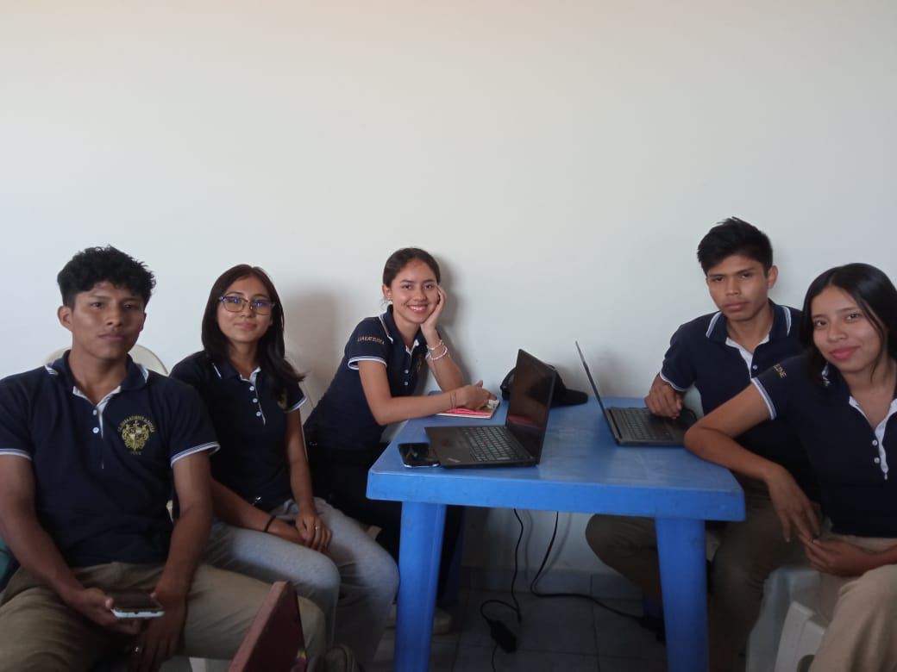

# 🎺 Garras Azules — Sitio Web Oficial

Este es el sitio web oficial de la **Banda Escolar “Garras Azules”** de la Unidad Educativa Juana Azurduy de Padilla, desarrollado como parte de un proyecto académico aplicando la metodología ágil **Scrum**.

## 🌐 URL pública

👉 [https://anniby.github.io/garras-azules-web/](https://anniby.github.io/garras-azules-web/)

## 📦 Contenido del sitio

El sitio incluye las siguientes secciones:

- 🏠 **Inicio**: Presentación general de la banda.
- 🎺 **Conócenos**: Historia y propósito del grupo.
- 📅 **Calendario**: Horarios de ensayos y actividades.
- 🎤 **Presentaciones**: Eventos destacados y fechas importantes.
- 📸 **Galería**: Imágenes ampliables y enlaces a videos.
- 💌 **Contáctanos**: Formulario funcional y redes sociales.

## ✅ Requerimientos Funcionales implementados

1. **Visualización del calendario de ensayos**  
   → Mejora la organización y asistencia de los estudiantes.

2. **Galería de imágenes con ampliación**  
   → Visibiliza el trabajo artístico y motiva a los integrantes.

3. **Formulario de contacto funcional**  
   → Facilita la comunicación externa y abre oportunidades.

## 📱 Requerimientos No Funcionales cumplidos

- Diseño responsive (adaptable a celulares y tablets).
- Carga rápida y estructura ligera.
- Navegación intuitiva y estética juvenil.

## 🚀 Tecnologías utilizadas

- HTML
- CSS
- JavaScript
- GitHub Pages (para despliegue)

## 👩‍💻 Rol del Product Owner

La planificación, priorización de requerimientos y presentación del producto final fueron dirigidas por **Camila**, en el rol de Product Owner, aplicando los principios de entrega de valor y mejora continua.

## Creadores de la Pagina Web
  - Product Owner: Camila Parra Barragán 
  - Scrum Master: Lua Taboada Rojas 
  - Desarrolladores: Eliazar Apaza, Limberth Ronaldo Vallejos y Chary Minza Velasco.

---

**¡Gracias por visitar nuestro sitio!** 

💙 Banda Escolar Garras Azules — Warnes, Santa Cruz, Bolivia

